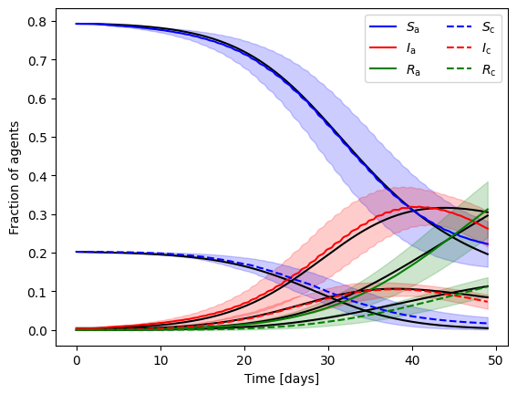
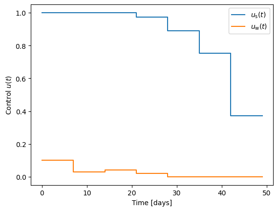
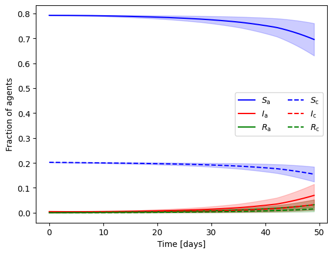

# Multilevel Optimization for Policy Design with Agent-Based Epidemic Models

Jan-Hendrik Niemann, Samuel Uram, Sarah Wolf, Nataša Djurdjevac Conrad and Martin Weiser

Epidemiological models can not only be used to forecast the course of a pandemic like COVID-19, but also to propose and design non-pharmaceutical interventions such as school and work closing. In general, the design of optimal policies leads to nonlinear optimization problems that can be solved by numerical algorithms. Epidemiological models come in different complexities, ranging from systems of simple ordinary differential equations (ODEs) to complex agent-based models (ABMs). The former allow a fast and straightforward optimization, but are limited in accuracy, detail, and parameterization, while the latter can resolve spreading processes in detail, but are extremely expensive to optimize. We consider policy optimization in a prototypical situation modeled as both ODE and ABM, review numerical optimization approaches, and propose a heterogeneous multilevel approach based on combining a fine-resolution ABM and  a coarse ODE model. Numerical experiments, in particular with respect to convergence speed, are given for illustrative examples.

## Prerequisits

* Install [GERDA](https://ford.biologie.hu-berlin.de/jwodke/corona_model) and initialize as described. If you use spyder (tested only under MacOS 12.6), please install it before using `pip install -e .` as otherwise spyder might not be installed correctly.
* Clone this repository `git clone https://github.com/Henningston/MLoptABM.git`

## How to use the Python and MATLAB Scripts

### Initialize Parameters

The initialization script `GERDA_opt_settings.py` sets all the necessary parameters used during the computations by all scripts. It also creates necessary initial files and a unique output directory to avoid loss of data. Furthermore, resuming older computations is possible.

The following parameters exist and can be set:

* `c1` Optimization parameter (fraction of descent). Default is 0.1.
* `data_path` Path to input and output subdirectory of `working_directory` called `data`.
* `duration_of_constant_control` Duration of constant control in hours. Needs to be a divisor of `total_timesteps`. Default is 168 [hours].
* `eps` Maximum relative error for gradient estimation. Default is 0.25.
* `fast_mode` Activate fast model which uses an ODE with Gaussian noise instead of the Markov ABM as dummy.
* `fd_step_size` Maximum finite difference step size. Default is 0.1.
* `fit_ODE` Iteratively fit an ODE to the GERDA simulation data. Default is false
* `general_infectivity` See GERDA for details. Default is 0.175.
* `general_interaction_frequency` See GERDA for details. Default is 1.
* `geofiles` Available geographical data. See GERDA for details.
* `geopath` Path to geofiles. Default is `input_data/geo/`.
* `grad_est_MC_sim_init` Initial number of Monte Carlo estimates of the gradient. Default is 100.
* `max_coarse_steps` Maximum number of coarse model iterations. Default is 100.
* `max_iterations` Maximum number of iterations of main algorithm. Default is 15.
* `n_agents` Number of agents of the GERDA model. Automatically updated if new world is created.
* `n_initially_infected` Number of initially infected agents. Default is 5.
* `obj_est_MC_sim_init` Initial number of Monte Carlo estimates of the objective function. Default is 100.
* `output_directory` Directory where the output data is saved.
* `path_to_GERDA` Path to GERDA model, e.g., `/Users/<username>/GERDA`.
* `resume_iterations_at` Continue computations at given iteration. Only for IGD algorithm!
* `rho` Maximum trust region radius. Default is 0.5.
* `rho_min` Minimum trust region radius. If it is passed, computations will be stopped. Default is 1e-4
* `samplesize_max` Maximum number of Monte Carlo simulations. Default is 1e6.
* `saved_world` Name of saved GERDA world object, e.g., `Reduced_Gangelt_n1096_worldObj.pkl` with 1096 agents. See GERDA for details.
* `total_timesteps` Number of time steps to simulate in hours. Needs to be a multiple of `duration_of_constant_control`. Default is 1,176 [hours].
* `u_school_max` Upper threshold on school closue. Default is 1.
* `u_school_min` Lower threshold on school closue. Default is 0.
* `u_work_max` Upper threshold on work closue. Default is 0.8.
* `u_work_min` Lower threshold on work closue. Default is 0.
* `working_directory` Working directory.
* `world_to_pick` World to choose from geofiles. See GERDA for details.

The settings are saved in `<your_data_path>/opt_settings.txt`.

For some scripts the shebang and path to `opt_settings.txt` need to be adjusted. This can be done using the script `adjust_files.py`. For example, replace `#!/Users/<username>/opt/anaconda3/envs/<name_of_GERDA_venv>/bin/python3.8` in `adjust_files.py` with the path to your virtual environment you are using to run GERDA. Then run `adjust_files.py`. All scripts should now be running without error.

### Fit an Ordinary Differential Equation (ODE) to GERDA

The script `ABM2ODE.m` fits an ODE to the output of GERDA. This script creates by default 1,000 Monte Carlo simulations using the given GERDA world. The result of the least-squares fit is saved in the output directory. If `gen_samples = false`, then an existing data set of GERDA is used for fitting. If `save_fit = false`, the output is not saved.

### Run the Optimization

`GERDA_state_estimation.py` and `GERDA_state_estimation_dummy.py` compute in parallel Monte Carlo estimates of the state and the corresponding objective function for a given control. The inputs for this script are automatically loaded from `opt_settings.txt`.

`GERDA_gradient_estimation.py` and `GERDA_gradient_estimation_dummy.py` compute in parallel Monte Carlo estimates of the gradient of the objective function with respect to the control using finite differences. The inputs for this script are automatically loaded from `opt_settings.txt`.

`GERDA_MLO.m` finds an optimal control for GERDA that minimizes the number of infections at a minimum objective function value using a multi-level optimization scheme.

`GERDA_MLO_dummy.m` finds an optimal control for a simple ABM that minimizes the number of infections at a minimum objective function value using a multi-level optimization scheme.

`GERDA_IGD_dummy.py` finds an optimal control for a simple ABM that minimizes the number of infections at a minimum objective function value using an inexact gradient decent optimization scheme.

### Plot the Result

A demonstration of how to plot the output data is given in `GERDA_plot.py`.

 

## Code Coverage
The codes have been tested under macOS 13.2 and Debian 5.10.113-1 using Python 3.8.2, MATLAB R2019b and MATLAB R2021b. The optimization using the H/ABM can be done on a standard computer. A high performance computer is strongly advised though.
